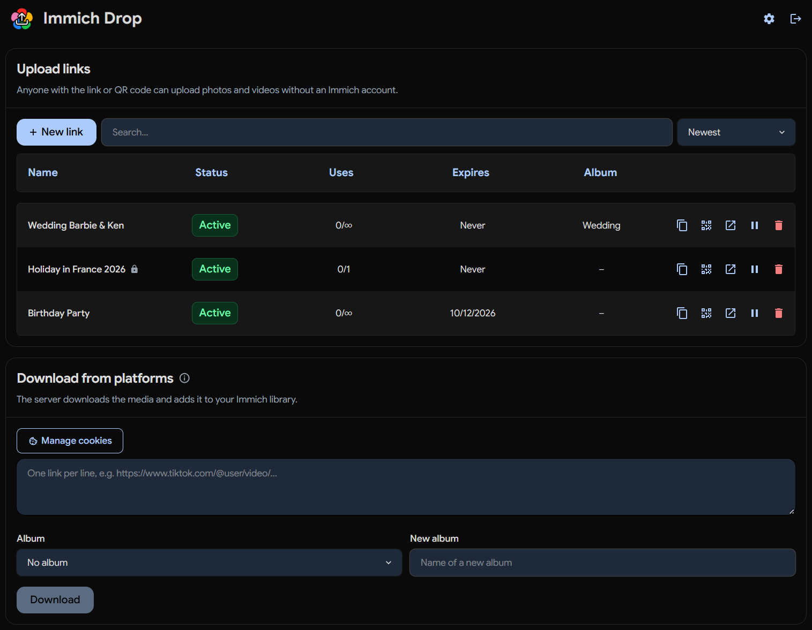
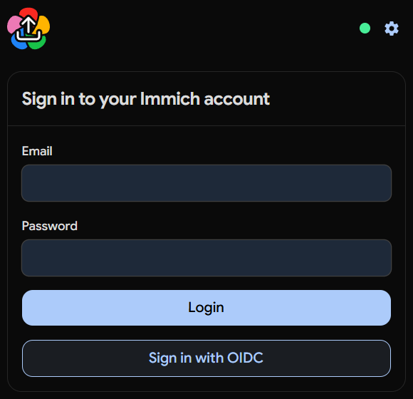
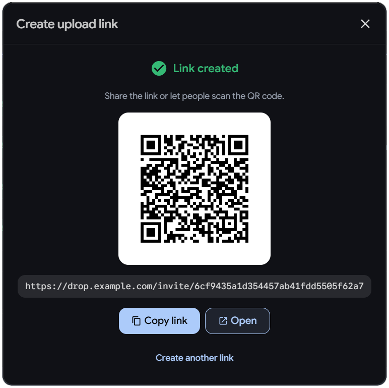
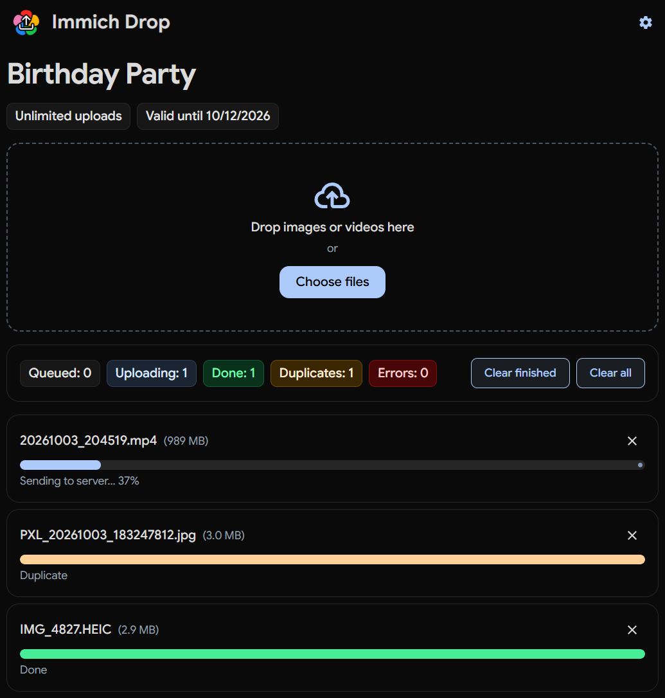

<div align="center">
  <picture>
    <source media="(prefers-color-scheme: dark)" srcset="frontend/immich-drop-dark.svg" />
    
  </picture>

  # Immich Drop

  **Upload links and platform downloads for Immich**
  
  A tiny web app that runs next to your Immich server: sign in with your Immich account, create upload links for others to upload media to your server, or download videos and images from social platforms straight into your library.

  

</div>

<details>
  <summary>More screenshots</summary>

  <br />

  <table>
    <tr>
      <td align="center" width="33%"><br /><sub>Sign in with your Immich account</sub></td>
      <td align="center" width="33%"><br /><sub>Share a link or QR code</sub></td>
      <td align="center" width="33%"><br /><sub>Upload page for guests</sub></td>
    </tr>
  </table>
</details>

## Core Features

- **Deep integration with Immich:** runs parallel to Immich, log in with your Immich account, and get the same look and feel, including dark mode
- **Upload links for guests:** share a link or QR code, and anyone can upload photos and videos without an Immich account into your library or a target album. Limit links by number of uses or expiry date, protect them with a password, disable or delete them at any time, and see who uploaded what; includes duplicate detection and preserves original file metadata
- **Download from platforms:** download content from TikTok, Instagram, Facebook, Reddit, YouTube, X/Twitter, and many more (via *yt-dlp* and *gallery-dl*) straight into your library. You can also use an [iOS shortcut](docs/ios-shortcuts.md) to send links more easily

## Quick Start

You need an **Immich** server and an **API key** for every user. Every user of your Immich instance can sign in, there is no separate user database. Create an API key in Immich under *Account settings > API keys*, with these permissions:

- `asset.upload`: upload files
- `album.read`: find albums
- `album.create`: create albums
- `albumAsset.create`: add files to albums
- `user.read`: verify the account

Files end up in the account the key belongs to, so every user creates their own key and adds it in their settings. If you want to save  everything in a single account, set its key as `IMMICH_API_KEY`; saved keys are then ignored.

Sessions last 14 days. Set `SESSION_SECRET` to a long random string, otherwise a restart logs everyone out.

```yaml
services:
  immich-drop:
    image: ghcr.io/dodekaphilist/immich-drop:latest
    container_name: immich-drop
    restart: unless-stopped
    ports:
      - 8080:8080
    environment:
      IMMICH_BASE_URL: https://immich.example.com
      PUBLIC_BASE_URL: https://drop.example.com    # supports subdomains and subfolders (see Reverse Proxy)
      SESSION_SECRET: ${SESSION_SECRET}    # any long random string
    volumes:
      - immich_drop_data:/data

volumes:
  immich_drop_data:
```

```bash
docker compose up -d
```


### Configuration

All settings are environment variables. `IMMICH_BASE_URL` and `PUBLIC_BASE_URL` are required; `SESSION_SECRET` is strongly recommended.

| Variable | Default | Description |
|---|---|---|
| `IMMICH_BASE_URL` | required | Address of your Immich server, e.g. `https://immich.example.com` |
| `IMMICH_API_KEY` | — | API key used by everyone (optional) |
| `PUBLIC_BASE_URL` | required | Public address of this app |
| `SESSION_SECRET` | random per start | Signs the session cookie |
| `IMMICH_ALBUM_NAME` | — | Album that is preselected for new links and downloads |
| `CHUNKED_UPLOADS_ENABLED` | `false` | Split large files into chunks (for proxies with request limits) |
| `CHUNK_SIZE_MB` | `95` | Chunk size; only larger files are chunked |
| `SOCIAL_MEDIA_UPLOADS_ENABLED` | `true` | Controls "Download from platforms" feature |
| `DOWNLOAD_CONCURRENCY` | `1` | Simultaneous platform downloads |
| `GALLERY_DL_SLEEP_REQUEST`, `GALLERY_DL_SLEEP`, `GALLERY_DL_TIMEOUT` | `10-25`, `5-15`, `300` | Pauses and timeout against rate limiting (seconds) |
| `INSTAGRAM_YTDLP_FALLBACK` | `false` | Fall back to yt-dlp for Instagram if gallery-dl fails |
| `SHORTCUT_ENABLED` | `false` | Controls ["iOS Shortcut"](docs/ios-shortcuts.md) feature |
| `TEST_CONNECTION_ENABLED` | `true` | Show the connection indicator on the login page |
| `TEST_CONNECTION_SHOW_HOSTNAME` | `true` | Include the Immich hostname in connection indicator |
| `HOST`, `PORT` | `0.0.0.0`, `8080` | Address and port the app listens on inside the container |
| `DATA_DIR` | `/data` | Location of `state.db`, `chunks/` and `cookies/` (only needed for local runs outside of Docker) |
| `LOG_LEVEL` | `INFO` | Log verbosity |


### Reverse proxy

The app works on its own subdomain (`https://drop.example.com`) and under a subfolder of Immich's domain (`https://immich.example.com/drop`); put the full public URL into `PUBLIC_BASE_URL`. If your proxy limits request sizes, enable chunked uploads. 

**Example for subfolder in nginx** (the WebSocket headers are needed for upload progress):

```nginx
location /drop/ {
    proxy_pass http://immich-drop:8080;
    proxy_http_version 1.1;
    proxy_set_header Host $host;
    proxy_set_header X-Forwarded-Proto $scheme;
    proxy_set_header X-Forwarded-For $proxy_add_x_forwarded_for;
    proxy_set_header Upgrade $http_upgrade;
    proxy_set_header Connection "upgrade";
    client_max_body_size 0;
}
```

### Login with SSO/OIDC

If you are using SSO/OIDC with your Immich server, add `<PUBLIC_BASE_URL>/oauth/callback` as a redirect URI at your identity provider, in addition to the ones Immich already uses.


### Download from platforms

Download content from social media using [*gallery-dl*](https://github.com/mikf/gallery-dl) (images and galleries) or [*yt-dlp*](https://github.com/yt-dlp/yt-dlp) (videos), and add it to Immich.

**Supported services**

- TikTok
- Instagram (Reels, posts, stories)
- Facebook (Reels, videos)
- Reddit (videos, images, galleries)
- YouTube (Shorts and videos)
- Twitter / X
- Flickr, Imgur (images and albums), Tumblr, Pinterest
- ArtStation, DeviantArt, Pixiv, Danbooru, Bluesky
- plus many more sites that gallery-dl knows, and direct image URLs

Platforms change their pages often, so certain services may stop working until *yt-dlp* and *gallery-dl* catch up.

**Cookies**

Some platforms (e.g., Instagram) block anonymous downloads entirely, requiring you to provide the server your browser's session for that platform.

1. Sign in to the platform in your browser.
2. Open the platform, press **F12** and switch to the **Network** tab, then reload the page.
3. Click the first request to the platform, find **Cookie** under *Request Headers*, and copy its whole value.
4. In the download section choose **Manage cookies**, pick the platform, paste the value and save.

Cookies belong to your account: other users neither see nor use them. They expire, and logging out in the browser invalidates them, so paste a fresh one when downloads start failing. Platforms may restrict accounts that are used for automated downloads, so a separate account is the safer choice. Cookies are only sent to their own platform and are stored *unencrypted*.

**Rate limits**

Platforms may also block clients that request too much too fast, so downloads are being slowed by default (pauses between requests (`GALLERY_DL_SLEEP_REQUEST`, `GALLERY_DL_SLEEP`) and downloads at a time (`DOWNLOAD_CONCURRENCY`)). If you still get blocked, raise the pauses and use cookies of a separate account. `GALLERY_DL_TIMEOUT` gives big carousels more time, `INSTAGRAM_YTDLP_FALLBACK=true` tries yt-dlp when gallery-dl fails (though easier to detect). `SOCIAL_MEDIA_UPLOADS_ENABLED=false` removes the feature including its endpoints.


## Architecture

- **Frontend:** a Svelte app (SvelteKit, static build) using the [`@immich/ui`](https://ui.immich.app) component library. Pages: login, start page (upload links and platform downloads), and the upload page `/invite/<token>`.
- **Backend:** FastAPI on Uvicorn. It forwards uploads to Immich (`/assets`), downloads media with gallery-dl and yt-dlp, serves the UI, and pushes upload progress to the browser over a WebSocket.
- **Login:** the app signs you in through Immich (password, or OAuth with PKCE via Immich's OAuth endpoints) and keeps your Immich token in a signed session cookie. Guests need no login; their link token is the only credential.
- **Persistence:** everything lives in `DATA_DIR`: one SQLite file (`state.db`) with links, the upload log, a cache of file hashes for duplicate detection (per Immich account), and the API keys and platform cookies of the users, plus cookie files and chunks as plain files.
- **Upload flow:** the browser sends the file (or chunks), the server hashes it, checks the local cache and Immich's bulk-upload check, streams it to Immich, adds it to the album, and reports each phase back over the WebSocket. Cancelling aborts the stream to Immich.
- **Known limit:** files are held in memory while they are processed, so very large files need that much RAM.

## Development

Requires Python 3.14 (as in the Docker image) and [Node.js](https://nodejs.org/) 22 or newer.

```bash
git clone https://github.com/dodekaphilist/immich-drop.git
cd immich-drop

# UI: build it and put it where the backend serves it from
cd web && npm install && npm run build && cd ..
cp -r web/build frontend/app            # PowerShell: Copy-Item -Recurse web/build frontend/app

# backend
pip install -r requirements.txt
cp .env.example .env                    # then edit it
python main.py                          # http://localhost:8080 (RELOAD=true restarts on code changes)
```

After UI changes rebuild and copy again. Project layout:

```
app/        FastAPI app: app.py (routes, uploads), api_routes.py (platform downloads),
            url_downloader.py, cookie_manager.py, immich_client.py, job_manager.py,
            db.py (tables), config.py, utils.py
web/        Svelte UI: src/routes (pages), src/lib (components, i18n, upload logic)
frontend/   static assets; the built UI goes to frontend/app
docs/       iOS Shortcut guide
```

Translations live in `web/src/lib/i18n.svelte.js`: add a dictionary and an entry in `LANGUAGES` for a new language.

## Security & Privacy

Access is limited to people with a valid link or an Immich login. API keys never reach the browser, and a request without a valid link or login is never carried out with a key.

- **Links:** the address contains a random 128-bit token. Passwords are stored as salted PBKDF2-SHA256 hashes and can not be shown again; links can expire, be limited, or be disabled. Guests only see their own current uploads, never your library.
- **Login:** requires an Immich account; the session cookie is signed with `SESSION_SECRET`, `SameSite=Lax`, and scoped to the subfolder if there is one. Put the app behind HTTPS.
- **What is stored:** file hashes, names and sizes for duplicate detection, and for every upload through a link the time, **IP address**, user agent, and a browser identifier, which you see in the link details. Cookies for platforms are stored unencrypted in `state.db` and as files in `DATA_DIR/cookies/`, separately for each user.
- **Downloads:** the server fetches the URLs you enter and refuses addresses in private or internal networks.
- **Outgoing connections:** your Immich server and the platforms you download from. No analytics, no external fonts or scripts.
- **API keys:** use keys with only the permissions listed above. Saved keys are stored *unencrypted* in `state.db`, so protect the data volume; users can remove theirs in the settings at any time. Shortcut tokens give access to the upload and download endpoints with the user's key, so keep them secret; users can revoke theirs in the settings.

## Disclaimer

This project is provided without warranty — use at your own risk. No affiliation with Immich, TikTok, Instagram, or any other platform. Downloading content may violate a platform's terms or copyright; you are responsible for what you save. Always keep backups of your library.

## License

[MIT](LICENSE), based on [Nasogaa/immich-drop](https://github.com/Nasogaa/immich-drop) and [ttlequals0/immich-drop](https://github.com/ttlequals0/immich-drop).
